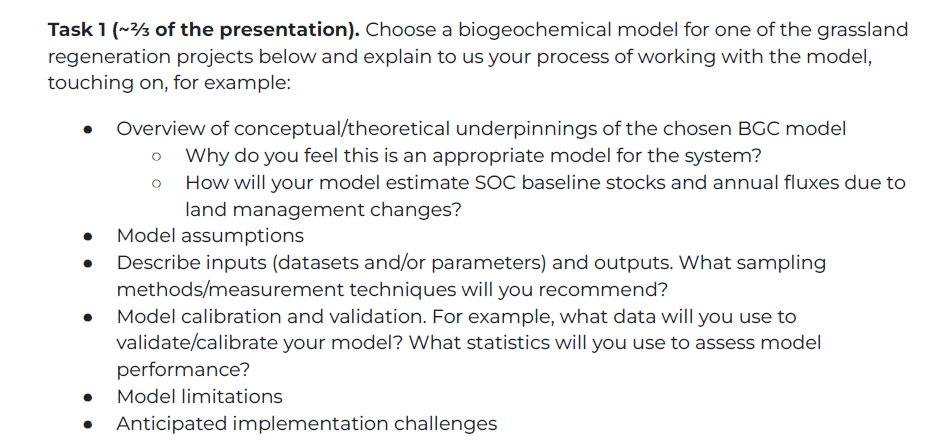
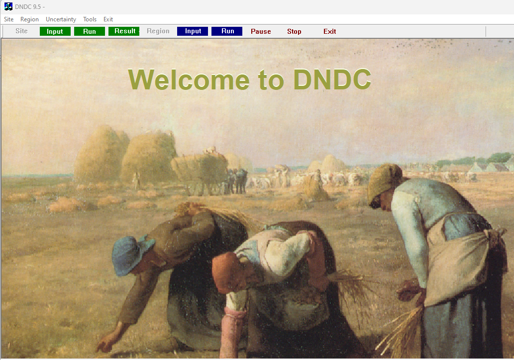
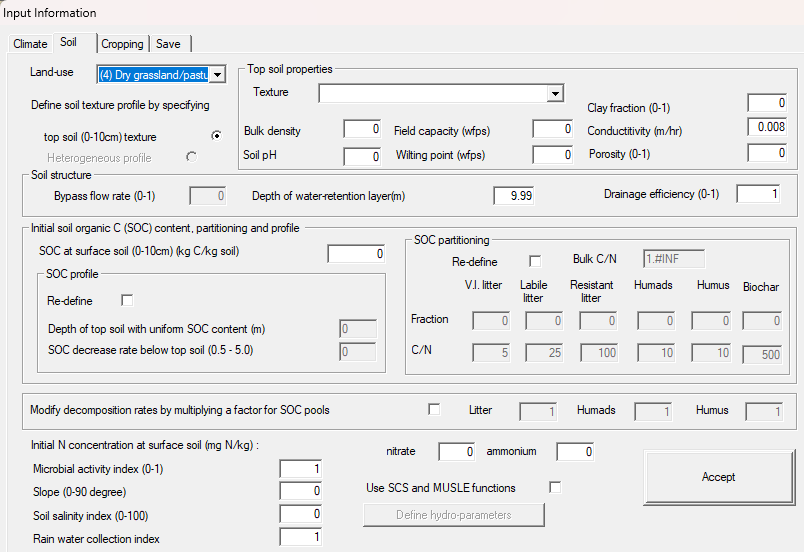
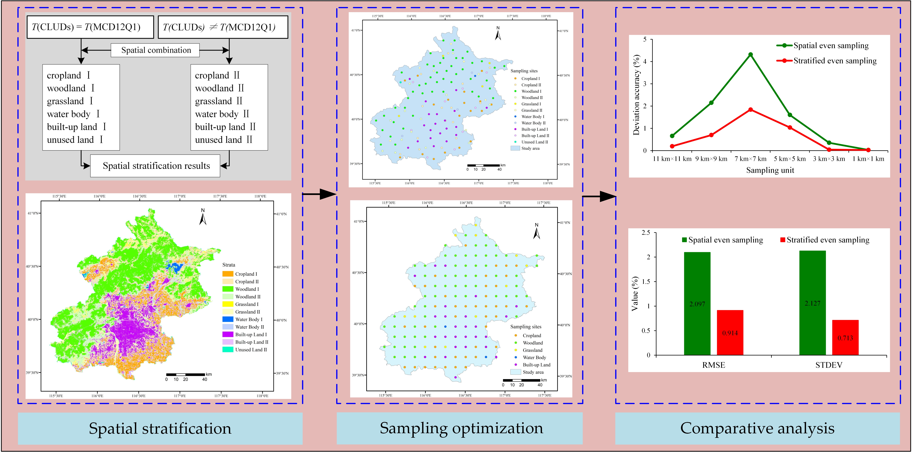

class: title-slide

```{r setup, include=FALSE}
knitr::opts_chunk$set(echo = FALSE, fig.path = "figures/")
library(tidyverse)
library(magick)
library(reticulate)
library(sf)
library(mapdeck)
#use_python("/Users/ulyngs/opt/anaconda3/bin/python")
xfun::pkg_load2(c('base64enc', 'htmltools', 'mime'))
```

.row[
.col-7[
.title[
### Cultivo - Soil Science Lead, Senior Manager.
]
 

.subtitle[
#### Interview with Ewan Oleghe
##### 28 February 2024
]
.author[
##### Ewan Oleghe, Dr.
]

.affiliation[
##### Ph.D Soil Science<br>University of Aberdeen.
]

]

.col-5[

.logo[
```{r}

```
]
<br>
<br>
---
Cultivo Land

Montana Data set:<br> [**CLICK HERE TO DOWNLOAD**](https://drive.google.com/file/d/1tnxUCGSVn4bcX_qW7lW0k16IRLkMnY_n/view)


]

]

---
### Task 1

```{r, out.width="100%"}

```


---
#### **Montana Dataset:** 


.pull-left[
```{r sf, echo=FALSE}
sf <- sf::st_read("../usa_montana.json")


```
]
.pull-right[

```{r echo = FALSE}
# Plot
par(mar = c(0,0,1,0))
plot(sf[1], reset = FALSE) # reset = FALSE: we want to add to a plot with a legend
plot(sf[1,1], col = 'grey', add = TRUE)
plot(sf[2,1], col = 'orange', add = TRUE)
plot(sf[3,1], col = 'purple', add = TRUE)
plot(sf[4,1], col = 'blue', add = TRUE)
```
]
---
#### ** Grassland Regenation in Montana** 
.pull-left[
##### DNDC DNDC (Denitrification-Decomposition) Model

```{r}

```
]

.pull-right[

##### DNDC Model Overview
Biogeochemical model that simulates carbon and nitrogen cycling in terrestrial ecosystems
##### Focus 
 - Greenhouse gas emissions
 - Soil carbon dynamics, and 
 - Nutrient cycling. 

Widely used to assess the impacts of land management practices, climate change, and other factors on soil organic carbon (SOC) stocks and fluxes.

]
---

.pull-left[
##### DNDC DNDC (Denitrification-Decomposition) Model
##### Uses
 - Estimate SOC baseline stocks
 - Predict the effects of different land management practices on SOC stocks and greenhouse gas emissions.

 The model requires input data such as climate data, soil properties, land use/cover, and management practices. 
 - It can provide valuable insights into the potential benefits of the Montana grassland regeneration projects in terms of soil carbon sequestration and greenhouse gas mitigation.
]

.pull-right[

##### DNDC Model - estimate SOC baseline stocks and annual fluxes due to land management changes
##### 1. Baseline SOC Stocks
 - Initial Measurements
 - Dynamic Simulation.

##### 2. Annual Fluxes due to Land Management Changes
 - Management Scenarios 
 - Changes in Input Parameters 
 - Simulation and Comparison:

##### 3. Model Outputs
 - Change in SOC Stocks 
 - Changes in Input Parameters 
 - Annual Fluxes: In (e.g., plant residue) and Out (e.g., decomposition, erosion)
]
---

.pull-left[
##### DNDC Model - estimate SOC baseline stocks and annual fluxes
##### 4. Validation and Sensitivity Analysis
 - Validation
 - Calibrate the model
 - Sensitivity Analysis

##### 5. Consider the historical land use and management practices to account for legacy effects on SOC stocks

]

.pull-right[

##### DNDC Model - Model assumptions for estimating SOC baseline stocks and annual fluxes
##### 1. Steady-State Assumption
##### 2. Homogeneous Soil Conditions
##### 3. Constant Climate Conditions (e.g., temperature, precipitation) over the simulation period
##### 4. Static Land Use Change Effects
##### 5. Linear Relationships
##### 6. Neglecting Other Factors influenceing SOC dynamics (e.g, erosion, landform changes, and biotic interactions)
##### 7. Model Calibration and Validation


]
---

.pull-left[
##### DNDC Model - Describe inputs (datasets and/or parameters) and outputs. What sampling methods/measurement techniques will you recommend?
##### 1. DNDC Model inputs
```{r}

```

]

.pull-right[

##### 2. DNDC Model inputs: Datasets & Parameters
##### i. Datasets
 - Climate Data
 - Soil Data
 - Land Use and Management  Data
 - Initial Soil Conditions
 
##### ii. Parameters
 - Plant Parameters
 - Microbial Parameters
 - Other Biogeochemical Parameters (biogeochemical processes e.g. C and N mineralization rates)
]
---

.pull-left[
##### DNDC Model - Output
##### 1. Carbon Dynamics
 - Total C in the system (soil, vegetation, and atmosphere).
 - Soil organic carbon stocks and changes over time.
 - $CO_{2}$ emissions from soil and vegetation.

##### 2. Nitrogen Dynamics:

 - Total N in the system (soil, vegetation, and atmosphere).
 - $NO_{3}^-$ and $NH_{4}^+$ conc in soil.
 - $N_{2}$O emissions from soil.

##### 3. Other Outputs:

 - Crop yields and biomass production.<br>
 -  Water balance components (evapotranspiration, soil moisture).
    - Nitrogen leaching and runoff.

]

.pull-right[

##### 2. DNDC Model inputs: Datasets & Parameters
##### i. Datasets
 - Climate Data
 - Soil Data
 - Land Use and Management  Data
 - Initial Soil Conditions
 
##### ii. Parameters
 - Plant Parameters
 - Microbial Parameters
 - Other Biogeochemical Parameters (biogeochemical processes e.g. C and N mineralization rates)
]
---

.pull-left[
##### What sampling methods/measurement techniques will you recommend?
##### 1. Climate Data
 - Temperature, precipitation, and solar radiation data [weather stations or meteorological databases].

##### 2. Soil Data

 - Conduct soil surveys to collect soil samples for analysis of texture, organic matter content, bulk density, pH, and other relevant properties.
 - soil databases or previous studies.

##### 3. Land Use and Management Data:

 - Collect data on land use, cropping systems, fertilization practices, and irrigation from field surveys or agricultural records.
 - Use remote sensing data for land use classification and monitoring changes over time.

]

.pull-right[

#####.  
##### 4. Measurement Techniques:

 - Use standard laboratory methods for analyzing soil samples for texture, organic matter content, bulk density, and pH.
 - Use established protocols for measuring crop yields, biomass production, and nutrient concentrations in soil and plants.
 - Employ eddy covariance or chamber-based systems for measuring greenhouse gas emissions from soil and vegetation.

]
---

.pull-left[
##### What data will you use to validate/calibrate your model? What statistics will you use to assess model performance?
##### a. Data for Calibration and Validation:

 - Field Data: Field measurements of soil carbon and nitrogen dynamics, greenhouse gas emissions (e.g., CO2, N2O), crop yields, and other relevant variables.
 - Experimental Data: Data from experimental studies or long-term monitoring sites.
 - Remote Sensing Data: Satellite or aerial imagery for land use/cover classification, vegetation productivity, etc.
 - Meteorological Data: High-quality meteorological data for temperature, precipitation, and solar radiation.

]

.pull-right[

#####  .
##### b. Statistics for Assessing Model Performance:

 - Root Mean Square Error (RMSE)
 - Coefficient of Determination (R2)
 - Bias
 - Model Efficiency (EF)
 - Normalized RMSE (NRMSE)
 - Percent Bias (PBIAS)

]
---

.pull-left[
##### DNDC Model limitations

 1. Simplification of Processes
 2. Input Data Requirements
 3. Parameterization
 4. Scale Dependency
 5. Limited Validation
 6. Assumptions
 7. Lack of Representation of Certain Processes
 8. Limited Spatial and Temporal Resolution
 9. Model Complexity

]

.pull-right[

##### Anticipated implementation challenges
 1. Data Availability and Quality
 2. Model Complexity
 3. Parameterization and Calibration
 4. Scale Dependency
 5. Model Validation
 6. Computational Resources
 7. Interpretation of Results

]
---

#### ** Task 2** 
.pull-left[
##### Digital soil stratification tool for grasslands/rangelands regeneration projects.

```{r}

```
]

.pull-right[

##### Key features and outputs of the tool
##### ** Soil Property Mapping
By integrating these scientific and conceptual elements, digital soil stratification tools provide valuable information for land use planning, agriculture, environmental management, and natural resource conservation

##### Potential limitations
 1. Data Availability and Quality
 2. Complexity and Interpretation
 3. Model Uncertainty |  6. Model Validation
 4. Temporal Dynamics | 7. Expertise and Resources
 5. Cost and Time | 8. Scale and Resolution

]

---
```{r}

```

---
class: center, middle

# Thank You!

